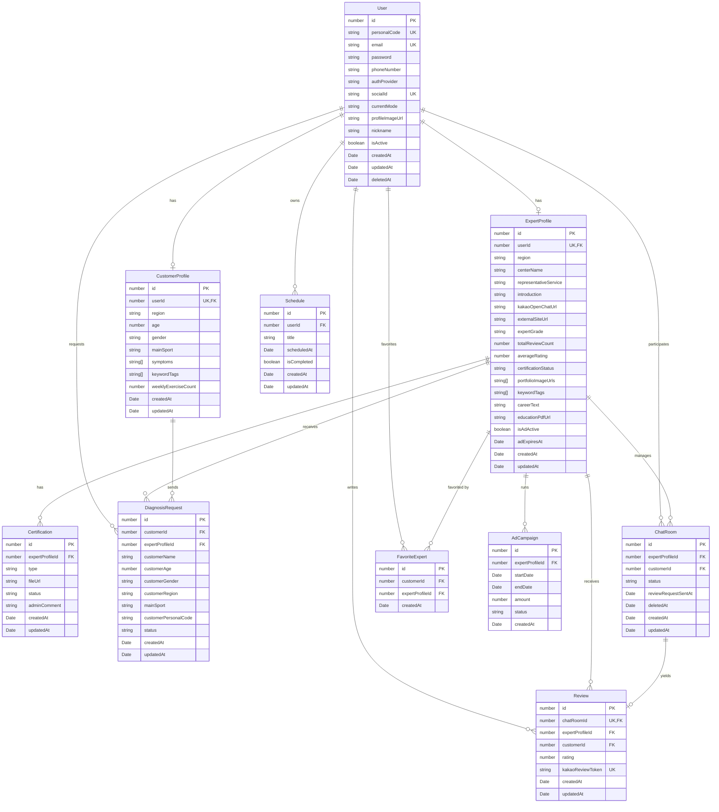

# Sports Master ERD

```mermaid
erDiagram
    User {
        number id PK
        string personalCode UK
        string email UK
        string password
        string phoneNumber
        string authProvider
        string socialId UK
        string currentMode
        string profileImageUrl
        string nickname
        boolean isActive
        Date createdAt
        Date updatedAt
        Date deletedAt
    }

    ExpertProfile {
        number id PK
        number userId UK,FK
        string region
        string centerName
        string representativeService
        string introduction
        string kakaoOpenChatUrl
        string externalSiteUrl
        string expertGrade
        number totalReviewCount
        number averageRating
        string certificationStatus
        string[] portfolioImageUrls
        string[] keywordTags
        string careerText
        string educationPdfUrl
        boolean isAdActive
        Date adExpiresAt
        Date createdAt
        Date updatedAt
    }

    CustomerProfile {
        number id PK
        number userId UK,FK
        string region
        number age
        string gender
        string mainSport
        string[] symptoms
        string[] keywordTags
        number weeklyExerciseCount
        Date createdAt
        Date updatedAt
    }

    Certification {
        number id PK
        number expertProfileId FK
        string type
        string fileUrl
        string status
        string adminComment
        Date createdAt
        Date updatedAt
    }

    DiagnosisRequest {
        number id PK
        number customerId FK
        number expertProfileId FK
        string customerName
        number customerAge
        string customerGender
        string customerRegion
        string mainSport
        string customerPersonalCode
        string status
        Date createdAt
        Date updatedAt
    }

    ChatRoom {
        number id PK
        number expertProfileId FK
        number customerId FK
        string status
        Date reviewRequestSentAt
        Date deletedAt
        Date createdAt
        Date updatedAt
    }

    Review {
        number id PK
        number chatRoomId UK,FK
        number expertProfileId FK
        number customerId FK
        number rating
        string kakaoReviewToken UK
        Date createdAt
        Date updatedAt
    }

    FavoriteExpert {
        number id PK
        number customerId FK
        number expertProfileId FK
        Date createdAt
    }

    Schedule {
        number id PK
        number userId FK
        string title
        Date scheduledAt
        boolean isCompleted
        Date createdAt
        Date updatedAt
    }

    AdCampaign {
        number id PK
        number expertProfileId FK
        Date startDate
        Date endDate
        number amount
        string status
        Date createdAt
    }

    User ||--o| ExpertProfile : "has"
    User ||--o| CustomerProfile : "has"
    User ||--o{ Review : "writes"
    User ||--o{ FavoriteExpert : "favorites"
    User ||--o{ Schedule : "owns"
    User ||--o{ DiagnosisRequest : "requests"
    User ||--o{ ChatRoom : "participates"

    ExpertProfile ||--o{ Certification : "has"
    ExpertProfile ||--o{ Review : "receives"
    ExpertProfile ||--o{ DiagnosisRequest : "receives"
    ExpertProfile ||--o{ ChatRoom : "manages"
    ExpertProfile ||--o{ FavoriteExpert : "favorited by"
    ExpertProfile ||--o{ AdCampaign : "runs"

    CustomerProfile ||--o{ DiagnosisRequest : "sends"

    ChatRoom ||--o| Review : "yields"
```
